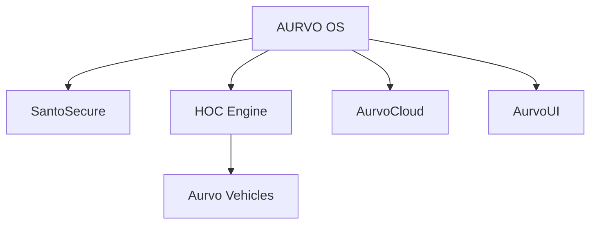

# AURVO OS
🔥 Powered by Maestro | SantoSecure | HOC Framework

## 🧠 AURVO Backend

El proyecto ahora expone una API modular construida con **Python 3.11** y **FastAPI** para orquestar los núcleos de SantoSecure, HOC Engine, AurvoCloud, AurvoUI y Aurvo Vehicles.

### 🚀 Inicio rápido

```bash
python -m venv .venv
source .venv/bin/activate
pip install -r requirements.txt
python backend/scripts/bootstrap.py
uvicorn backend.app.main:app --reload
```

La API estará disponible en `http://localhost:8000` con documentación interactiva en `/docs` y `/redoc`.

### 🗃 Bases de datos por módulo

Cada módulo tiene su propia base de datos SQLite ubicada en `data/<modulo>.db`. Estas se inicializan automáticamente durante el arranque de la aplicación o ejecutando `python backend/scripts/bootstrap.py`.

### 🐳 Docker y contenedores

```bash
docker compose up --build
```

Se expone la API en `http://localhost:8000` y los archivos de datos quedan montados para persistencia local.

### 🚢 Integración con GitHub Actions

El workflow [`aurvo-backend`](.github/workflows/backend.yml) compila el código, construye la imagen Docker y la publica en `ghcr.io`. El script [`deploy.sh`](deploy.sh) dispara el flujo de publicación y mantiene activa la landing en GitHub Pages.

### 🧬 Arquitectura Cognitiva


